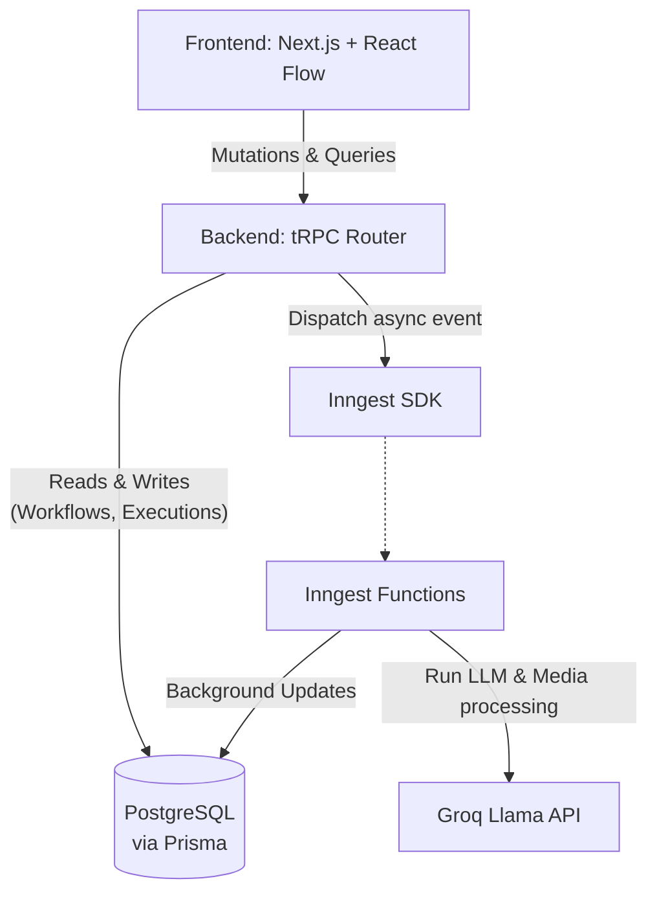
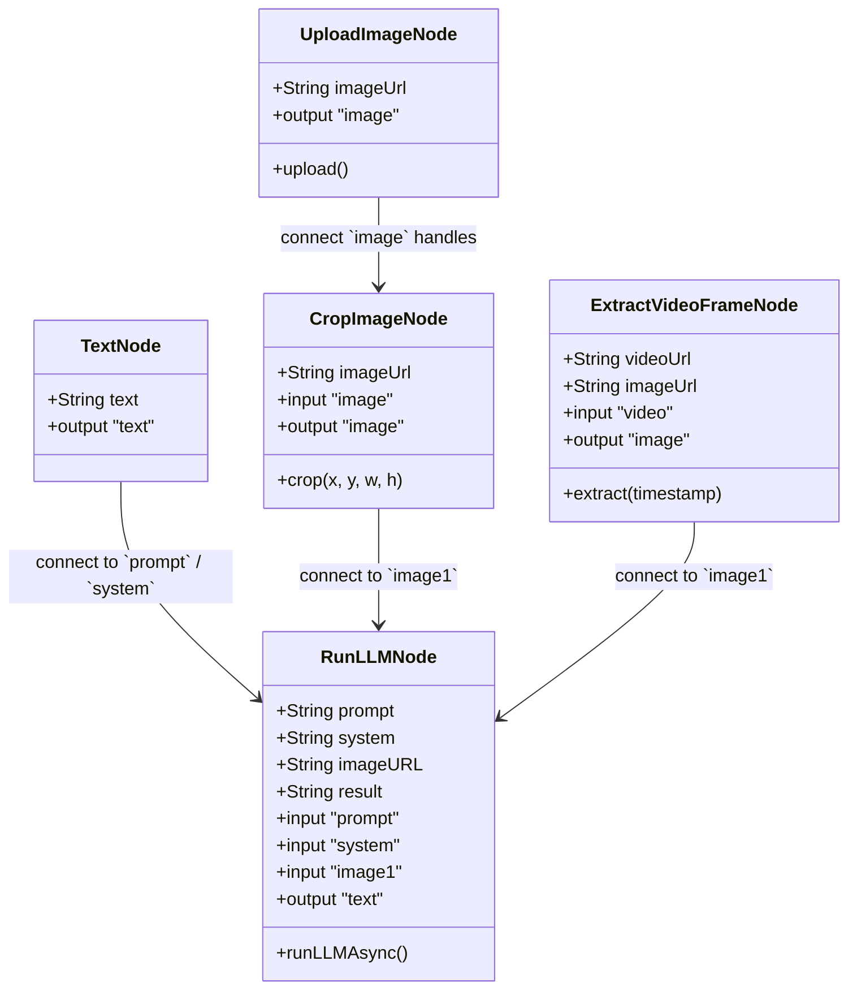

# Weavy-Clone

Weavy-Clone is a node-based workflow builder designed to execute language models, process multimedia, and chain logical steps together visually. The platform offers an intuitive drag-and-drop workspace where complex processes can be assembled quickly from discrete action nodes.

## Core Features
- **Visual Node Editor**: Build complete processes by connecting `Image Upload -> Frame Extract -> Run LLM -> Output`.
- **Background Execution**: LLM invocations and heavy media processes are completely offloaded to resilient background workers utilizing **Inngest** for zero UI blocking.
- **Serverless API**: Fast, type-safe API routing using **tRPC**, with queries directly tied to a cloud Postgres schema.

## Architecture

Weavy-Clone relies on a specialized modern stack ensuring fast iteration and robust production-ready services:
- **Next.js 15 (App Router)** & **React**: Core frameworks.
- **tRPC** + **React Query**: Type-safe seamless client-server communication mechanism.
- **Prisma** + **PostgreSQL**: Declarative data modeling and database manipulation.
- **Inngest**: Background worker handling long or heavy asynchronous functions (e.g. LLM calls).
- **Zustand**: Managing the rich state required by the React Flow components.
- **Clerk**: Comprehensive user authentication and session management.



## Class Diagram

Nodes in the editor represent physical modules. Below is a structural class diagram representing how these Node states relate structurally to each other in the UI:



## Repository Structure

```text
weavy-clone/
├── prisma/
│   └── schema.prisma       # Database schema mapping
├── src/
│   ├── app/                # Next.js Application Routes
│   │   ├── api/
│   │   │   ├── inngest/    # Inngest Background Route
│   │   │   └── trpc/       # tRPC Server Handler Route
│   │   ├── flow/           # The active workflow builder view
│   │   └── dashboard/      # User project dashboard
│   ├── components/         # Reusable UI & Workflow elements
│   │   ├── workflow/
│   │   │   ├── nodes/      # Specific drag-and-drop Nodes
│   │   │   ├── EditorCanvas.tsx
│   │   │   └── WorkflowWrapper.tsx
│   │   └── ui/             # Radix (shadcn) UI generic components
│   ├── trpc/               # tRPC Provider definitions
│   ├── server/             # Server Logic Layer
│   │   └── api/
│   │       ├── routers/    # Router Definitions (e.g. workflow endpoints)
│   │       └── trpc.ts     # Core trpc configuration and session injector
│   ├── inngest/            # Background Function Registry
│   │   ├── client.ts       # Global Client Instantiator
│   │   └── functions.ts    # Long-running workers (LLMs)
│   └── lib/                # Shared utilities & configurations
│       └── cloudinary.ts   # Image & Upload transformations
└── package.json
```

## Getting Started

1. Set your `.env` following `.env.example`.
2. Generate Database:
```bash
npx prisma generate
npx prisma db push
```
3. Run dev server:
```bash
npm run dev
```
